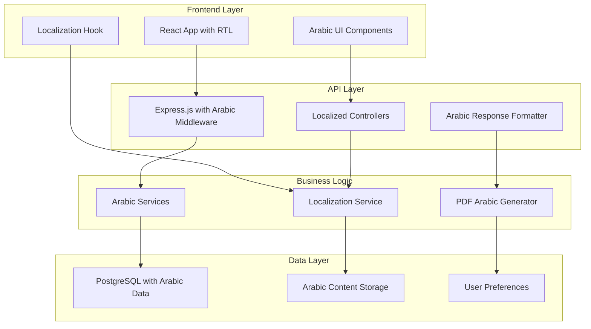

# تصميم تحويل BreakApp إلى نظام عربي متكامل
# Design Document: Arabic Full Stack BreakApp Conversion

## نظرة عامة

هذا التصميم يحول تطبيق BreakApp الحالي إلى نظام Full Stack متكامل باللغة العربية، مع دعم كامل لـ RTL وتجربة مستخدم عربية أصيلة. التصميم يركز على الحفاظ على الوظائف الحالية مع إضافة طبقة تعريب شاملة وتحسينات في تجربة المستخدم.

## البنية المعمارية

### البنية العامة



### مكونات النظام الرئيسية

#### 1. طبقة التعريب (Localization Layer)
- **نظام الترجمة المركزي**: إدارة جميع النصوص العربية
- **كشف اللغة التلقائي**: تحديد لغة المستخدم من headers أو تفضيلات
- **استبدال المعاملات**: دعم المتغيرات في النصوص العربية
- **تخزين التفضيلات**: حفظ اختيارات اللغة للمستخدم

#### 2. طبقة الواجهة الأمامية (Frontend Layer)
- **مكونات React عربية**: جميع المكونات مصممة لدعم RTL
- **نظام التخطيط العربي**: ترتيب العناصر من اليمين لليسار
- **الخطوط العربية**: استخدام خطوط واضحة ومقروءة
- **التفاعل العربي**: إيماءات وتفاعلات مناسبة للثقافة العربية

#### 3. طبقة API العربية (Arabic API Layer)
- **Controllers معربة**: جميع وحدات التحكم تستخدم الرسائل العربية
- **معالجة الأخطاء العربية**: رسائل خطأ واضحة ومفهومة
- **التحقق العربي**: رسائل التحقق من البيانات بالعربية
- **تنسيق الاستجابات**: هيكلة البيانات المناسبة للعربية

#### 4. طبقة الخدمات العربية (Arabic Services Layer)
- **خدمة التوصيات العربية**: اقتراحات مناسبة للثقافة العربية
- **خدمة التقارير العربية**: إنشاء تقارير PDF بالعربية
- **خدمة الإشعارات العربية**: إرسال إشعارات بالعربية
- **خدمة الدفع العربية**: معالجة المدفوعات مع واجهة عربية

## المكونات والواجهات

### 1. مكونات الواجهة الأمامية

#### مكون التخطيط الرئيسي (MainLayout)
```typescript
interface MainLayoutProps {
  children: React.ReactNode;
  direction: 'rtl' | 'ltr';
  language: 'ar' | 'en';
}

const MainLayout: React.FC<MainLayoutProps> = ({
  children,
  direction,
  language
}) => {
  return (
    <div className={`app-layout ${direction}`} dir={direction}>
      <ArabicHeader language={language} />
      <ArabicSidebar direction={direction} />
      <main className="main-content">
        {children}
      </main>
      <ArabicFooter language={language} />
    </div>
  );
};
```

#### مكون القائمة العربية (ArabicMenu)
```typescript
interface MenuItem {
  id: string;
  nameAr: string;
  nameEn: string;
  descriptionAr: string;
  price: number;
  category: string;
  isHalal: boolean;
  allergens: string[];
}

interface ArabicMenuProps {
  items: MenuItem[];
  onItemSelect: (item: MenuItem) => void;
  language: 'ar' | 'en';
}

const ArabicMenu: React.FC<ArabicMenuProps> = ({
  items,
  onItemSelect,
  language
}) => {
  const { t } = useTranslation(language);
  
  return (
    <div className="arabic-menu">
      {items.map(item => (
        <ArabicMenuItem
          key={item.id}
          item={item}
          onSelect={onItemSelect}
          language={language}
        />
      ))}
    </div>
  );
};
```

#### مكون الطلب العربي (ArabicOrder)
```typescript
interface OrderItem {
  menuItemId: string;
  quantity: number;
  specialInstructions?: string;
}

interface ArabicOrderProps {
  items: OrderItem[];
  total: number;
  onSubmit: (order: OrderData) => void;
  language: 'ar' | 'en';
}

const ArabicOrder: React.FC<ArabicOrderProps> = ({
  items,
  total,
  onSubmit,
  language
}) => {
  const { t } = useTranslation(language);
  
  return (
    <div className="arabic-order">
      <h2>{t('orders.orderSummary')}</h2>
      <ArabicOrderItems items={items} language={language} />
      <ArabicOrderTotal total={total} language={language} />
      <ArabicOrderActions onSubmit={onSubmit} language={language} />
    </div>
  );
};
```

### 2. واجهات API العربية

#### واجهة Controller العربي
```typescript
interface ArabicController {
  // الحصول على الرسالة المترجمة
  getMessage(key: string, params?: Record<string, any>): string;
  
  // إرسال استجابة نجاح
  sendSuccess(res: Response, message: string, data?: any): void;
  
  // إرسال استجابة خطأ
  sendError(res: Response, message: string, statusCode?: number): void;
  
  // التحقق من صحة البيانات
  validateInput(data: any, rules: ValidationRules): ValidationResult;
}
```

#### واجهة خدمة التعريب
```typescript
interface LocalizationService {
  // الحصول على رسالة مترجمة
  getMessage(key: string, language: string, params?: Record<string, any>): string;
  
  // كشف لغة المستخدم
  detectLanguage(request: Request): string;
  
  // تنسيق التاريخ والوقت
  formatDateTime(date: Date, language: string): string;
  
  // تنسيق الأرقام والعملة
  formatNumber(number: number, language: string): string;
  formatCurrency(amount: number, currency: string, language: string): string;
}
```

### 3. خدمات النظام العربية

#### خدمة التقارير العربية
```typescript
interface ArabicReportService {
  // إنشاء تقرير PDF عربي
  generateArabicPDF(data: ReportData, template: string): Promise<Buffer>;
  
  // تنسيق البيانات للعربية
  formatDataForArabic(data: any): any;
  
  // إضافة الخطوط العربية
  addArabicFonts(doc: PDFDocument): void;
  
  // تطبيق تخطيط RTL
  applyRTLLayout(doc: PDFDocument): void;
}
```

#### خدمة الإشعارات العربية
```typescript
interface ArabicNotificationService {
  // إرسال إشعار عربي
  sendArabicNotification(
    userId: string,
    type: NotificationType,
    message: string,
    data?: any
  ): Promise<void>;
  
  // إرسال بريد إلكتروني عربي
  sendArabicEmail(
    to: string,
    subject: string,
    template: string,
    data: any
  ): Promise<void>;
  
  // إرسال رسالة نصية عربية
  sendArabicSMS(
    phoneNumber: string,
    message: string
  ): Promise<void>;
}
```

## نماذج البيانات

### نموذج المستخدم العربي
```typescript
interface ArabicUser {
  id: string;
  email: string;
  firstName: string;
  lastName: string;
  phoneNumber?: string;
  role: UserRole;
  
  // تفضيلات اللغة
  language: 'ar' | 'en';
  dateFormat: 'hijri' | 'gregorian' | 'both';
  numberFormat: 'arabic' | 'western';
  
  // الإعدادات العربية
  preferences: {
    rtlLayout: boolean;
    arabicNotifications: boolean;
    culturalRecommendations: boolean;
  };
  
  createdAt: Date;
  updatedAt: Date;
}
```

### نموذج القائمة العربية
```typescript
interface ArabicMenuItem {
  id: string;
  restaurantId: string;
  
  // الأسماء والأوصاف
  nameAr: string;
  nameEn: string;
  descriptionAr?: string;
  descriptionEn?: string;
  
  // معلومات الطعام
  price: number;
  category: string;
  imageUrl?: string;
  isAvailable: boolean;
  
  // المعلومات الثقافية
  isHalal: boolean;
  isVegetarian: boolean;
  spiceLevel: number; // 1-5
  
  // معلومات الحساسية
  allergens: string[];
  ingredients: string[];
  
  // المعلومات الغذائية
  nutritionalInfo?: NutritionalInfo;
  
  createdAt: Date;
  updatedAt: Date;
}
```

### نموذج الطلب العربي
```typescript
interface ArabicOrder {
  id: string;
  userId: string;
  restaurantId: string;
  projectId?: string;
  
  // حالة الطلب
  status: OrderStatus;
  statusAr: string; // الحالة بالعربية
  
  // تفاصيل الطلب
  items: ArabicOrderItem[];
  totalAmount: number;
  
  // معلومات التوصيل
  deliveryAddress?: string;
  deliveryInstructions?: string;
  estimatedDeliveryTime?: Date;
  
  // الملاحظات العربية
  notesAr?: string;
  specialRequests?: string[];
  
  createdAt: Date;
  updatedAt: Date;
}
```

## خصائص الصحة (Correctness Properties)

*خاصية الصحة هي سمة أو سلوك يجب أن يكون صحيحاً عبر جميع عمليات تشغيل النظام الصالحة - في الأساس، بيان رسمي حول ما يجب أن يفعله النظام. الخصائص تعمل كجسر بين المواصفات المقروءة بشرياً وضمانات الصحة القابلة للتحقق آلياً.*

### خاصية 1: استجابة API العربية الشاملة
*لأي* طلب API صالح، يجب أن تكون جميع الرسائل في الاستجابة باللغة العربية عندما تكون لغة المستخدم المفضلة هي العربية
**يتحقق من: المتطلبات 1.1, 1.2, 1.3**

### خاصية 2: دعم RTL الشامل
*لأي* عنصر واجهة مستخدم، يجب أن يكون الاتجاه من اليمين لليسار عندما تكون اللغة المحددة هي العربية
**يتحقق من: المتطلبات 2.2, 2.5**

### خاصية 3: استبدال المعاملات العربية
*لأي* رسالة تحتوي على معاملات، يجب أن يتم استبدال المعاملات بالقيم الصحيحة مع الحفاظ على التنسيق العربي
**يتحقق من: المتطلبات 1.4**

### خاصية 4: كشف اللغة التلقائي
*لأي* طلب HTTP، يجب أن يكتشف النظام اللغة المفضلة للمستخدم من headers أو تفضيلات المستخدم المحفوظة
**يتحقق من: المتطلبات 1.5**

### خاصية 5: حفظ تفضيلات اللغة
*لأي* مستخدم يغير إعدادات اللغة، يجب أن يحفظ النظام هذه التفضيلات ويستخدمها في الجلسات المستقبلية
**يتحقق من: المتطلبات 2.6**

### خاصية 6: تنسيق PDF العربي
*لأي* تقرير PDF يتم إنشاؤه، يجب أن يدعم النص العربي مع اتجاه RTL والخطوط المناسبة
**يتحقق من: المتطلبات 3.3, 5.5**

### خاصية 7: إشعارات عربية شاملة
*لأي* إشعار يتم إرساله، يجب أن يكون المحتوى باللغة العربية عندما تكون لغة المستخدم المفضلة هي العربية
**يتحقق من: المتطلبات 4.5, 10.1, 10.2**

### خاصية 8: تنسيق التاريخ والوقت العربي
*لأي* تاريخ أو وقت يتم عرضه، يجب أن يكون بالتنسيق المحلي مع دعم التقويم الهجري عند الطلب
**يتحقق من: المتطلبات 5.6, 10.5**

### خاصية 9: البحث والتصفية العربية
*لأي* عملية بحث أو تصفية، يجب أن تدعم النصوص العربية وتعيد نتائج مناسبة
**يتحقق من: المتطلبات 3.6**

### خاصية 10: أداء التحميل المقبول
*لأي* صفحة في التطبيق، يجب أن يكون وقت التحميل أقل من 3 ثوان مع المحتوى العربي
**يتحقق من: المتطلبات 13.1**

### خاصية 11: استجابة التفاعل السريعة
*لأي* تفاعل مستخدم مع النظام، يجب أن تكون الاستجابة في أقل من 500 مللي ثانية
**يتحقق من: المتطلبات 13.3**

### خاصية 12: دعم الأجهزة المحمولة العربي
*لأي* جهاز محمول، يجب أن يتكيف التطبيق مع حجم الشاشة مع الحفاظ على تخطيط RTL
**يتحقق من: المتطلبات 14.1, 14.4**

## معالجة الأخطاء

### استراتيجية معالجة الأخطاء العربية

#### 1. تصنيف الأخطاء
- **أخطاء التحقق**: رسائل واضحة بالعربية للبيانات غير الصحيحة
- **أخطاء النظام**: رسائل عامة بالعربية دون كشف تفاصيل تقنية
- **أخطاء الشبكة**: رسائل مفهومة للمستخدم العربي
- **أخطاء الصلاحيات**: شرح واضح لسبب رفض الوصول

#### 2. هيكل رسائل الخطأ العربية
```typescript
interface ArabicErrorResponse {
  success: false;
  error: {
    code: string;
    messageAr: string;
    messageEn?: string;
    details?: any;
    suggestions?: string[]; // اقتراحات لحل المشكلة
  };
  timestamp: string;
  requestId: string;
}
```

#### 3. معالج الأخطاء المركزي
```typescript
class ArabicErrorHandler {
  static handle(error: Error, req: Request, res: Response) {
    const language = req.lang || 'ar';
    const errorMessage = this.getLocalizedErrorMessage(error, language);
    
    const response: ArabicErrorResponse = {
      success: false,
      error: {
        code: error.code || 'UNKNOWN_ERROR',
        messageAr: errorMessage,
        suggestions: this.getErrorSuggestions(error, language)
      },
      timestamp: new Date().toISOString(),
      requestId: req.id
    };
    
    res.status(this.getStatusCode(error)).json(response);
  }
}
```

## استراتيجية الاختبار

### نهج الاختبار المزدوج

#### اختبارات الوحدة (Unit Tests)
- **اختبار مكونات الترجمة**: التحقق من صحة الترجمات والاستبدال
- **اختبار تنسيق RTL**: فحص CSS وتخطيط العناصر
- **اختبار كشف اللغة**: التحقق من اكتشاف اللغة من مصادر مختلفة
- **اختبار تنسيق التاريخ**: فحص تنسيق التواريخ العربية والهجرية

#### اختبارات الخصائص (Property-Based Tests)
- **اختبار شمولية الترجمة**: التحقق من ترجمة جميع النصوص
- **اختبار دعم RTL**: فحص جميع المكونات لدعم الاتجاه العربي
- **اختبار الأداء**: قياس أوقات التحميل والاستجابة
- **اختبار التوافق**: فحص التوافق مع المتصفحات والأجهزة

### إعداد اختبارات الخصائص

**مكتبة الاختبار**: Jest مع fast-check للاختبارات القائمة على الخصائص
**الحد الأدنى للتكرارات**: 100 تكرار لكل اختبار خاصية
**تنسيق العلامات**: **Feature: arabic-full-stack-conversion, Property {number}: {property_text}**

### أمثلة على اختبارات الخصائص

```typescript
// اختبار خاصية الاستجابة العربية الشاملة
describe('Arabic API Response Property', () => {
  test('All API responses should be in Arabic when user language is Arabic', 
    async () => {
      await fc.assert(fc.asyncProperty(
        fc.record({
          endpoint: fc.constantFrom('/api/orders', '/api/menu', '/api/users'),
          method: fc.constantFrom('GET', 'POST', 'PUT'),
          headers: fc.record({
            'Accept-Language': fc.constant('ar')
          })
        }),
        async (testCase) => {
          const response = await request(app)
            [testCase.method.toLowerCase()](testCase.endpoint)
            .set(testCase.headers);
          
          // التحقق من أن جميع الرسائل عربية
          expect(isArabicText(response.body.message)).toBe(true);
        }
      ), { numRuns: 100 });
    }
  );
});

// اختبار خاصية دعم RTL
describe('RTL Support Property', () => {
  test('All UI components should support RTL when language is Arabic',
    () => {
      fc.assert(fc.property(
        fc.record({
          componentName: fc.constantFrom('Menu', 'Order', 'Dashboard'),
          language: fc.constant('ar')
        }),
        (testCase) => {
          const component = render(
            <TestComponent name={testCase.componentName} language={testCase.language} />
          );
          
          // التحقق من دعم RTL
          expect(component.container.dir).toBe('rtl');
          expect(component.container.className).toContain('rtl');
        }
      ), { numRuns: 100 });
    }
  );
});
```

### اختبارات التكامل العربية

#### اختبار تدفق الطلب الكامل
```typescript
describe('Arabic Order Flow Integration', () => {
  test('Complete order flow should work in Arabic', async () => {
    // تسجيل الدخول بمستخدم عربي
    const user = await loginArabicUser();
    
    // عرض القائمة بالعربية
    const menu = await getArabicMenu();
    expect(menu.items.every(item => item.nameAr)).toBe(true);
    
    // إضافة عناصر للسلة
    const order = await createArabicOrder(menu.items[0]);
    expect(order.confirmationMessageAr).toBeDefined();
    
    // تأكيد الطلب
    const confirmation = await confirmOrder(order.id);
    expect(isArabicText(confirmation.message)).toBe(true);
    
    // تتبع الطلب
    const tracking = await trackOrder(order.id);
    expect(isArabicText(tracking.statusAr)).toBe(true);
  });
});
```

### اختبارات الأداء العربية

#### اختبار سرعة التحميل
```typescript
describe('Arabic Performance Tests', () => {
  test('Arabic pages should load within 3 seconds', async () => {
    const startTime = Date.now();
    
    const response = await request(app)
      .get('/dashboard')
      .set('Accept-Language', 'ar');
    
    const loadTime = Date.now() - startTime;
    expect(loadTime).toBeLessThan(3000);
    expect(response.status).toBe(200);
  });
  
  test('Arabic font loading should be optimized', async () => {
    const fontLoadTime = await measureArabicFontLoadTime();
    expect(fontLoadTime).toBeLessThan(1000); // أقل من ثانية واحدة
  });
});
```

## الخلاصة

هذا التصميم يوفر إطار عمل شامل لتحويل BreakApp إلى نظام عربي متكامل مع:

- **تعريب كامل للنظام الخلفي**: جميع Controllers والخدمات معربة
- **واجهة مستخدم عربية أصيلة**: دعم RTL كامل وتجربة مستخدم مناسبة
- **نظام اختبار شامل**: اختبارات وحدة وخصائص لضمان الجودة
- **أداء محسن**: تحميل سريع واستجابة فورية
- **دعم ثقافي**: مراعاة الخصوصيات الثقافية والدينية العربية

التصميم قابل للتطوير والصيانة، مع هيكل واضح يسمح بإضافة ميزات جديدة بسهولة مع الحفاظ على الطابع العربي للنظام.